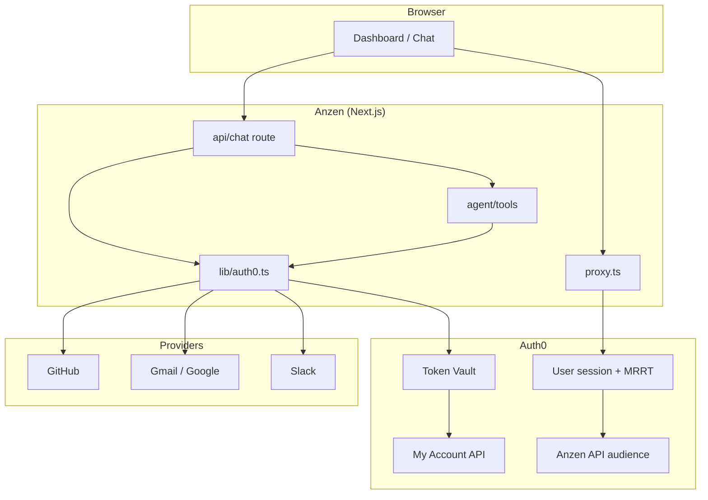

# Anzen — Architecture (Auth0 Token Vault)

This document is the canonical map of how Anzen uses Auth0. It mirrors Auth0’s own model: **your app never stores third-party credentials** — Auth0 holds federated tokens in Token Vault, and Anzen requests short-lived access tokens at runtime.

---

## Design principle (Auth0’s model)

> Anzen is a **Regular Web Application** that authenticates users through Auth0 and delegates OAuth to **Connected Accounts**. Third-party tokens live in Auth0 Token Vault, not in Anzen’s database, env files, or session.

Anzen only ever holds:

1. An **Auth0 session** (encrypted cookie via `@auth0/nextjs-auth0`)
2. **Ephemeral provider access tokens** inside a single API request (tool execution)

---

## Actors and APIs

| Actor | Role in Anzen |
|--------|----------------|
| **User** | Signs in to Anzen; connects GitHub, Gmail, Slack via Connected Accounts |
| **Anzen app** (`gbUeOd5OL7…`) | Next.js Regular Web App — login, connect, chat, dashboard |
| **Auth0 tenant** | Identity provider, session issuer, Token Vault store |
| **My Account API** | Connected Accounts scopes (`read/create/delete:me:connected_accounts`); list and delete linked accounts |
| **Anzen API** (`https://anzen.api`) | Custom API **audience** for MRRT / Token Vault login (no custom scopes required) |
| **GitHub / Google / Slack** | Upstream OAuth providers; must issue **refresh tokens** where required |

---

## Connection map

| UI label | Auth0 connection name | Purpose |
|----------|----------------------|---------|
| GitHub | `github` | Connected Accounts for Token Vault |
| Gmail | `google-oauth2` | Connected Accounts for Token Vault |
| Slack | `sign-in-with-slack` | Connected Accounts for Token Vault (name is fixed after create) |

Provider OAuth apps must callback to **`https://{tenant}.auth0.com/login/callback`**, not `localhost`.

---

## Request flows

### 1. Sign in (establish Auth0 session)

```
Browser → GET /auth/login
       → Auth0 /authorize
          scope: openid profile email offline_access
                 + read/create/delete:me:connected_accounts  (when AUTH0_TOKEN_VAULT_SCOPES=true)
          audience: https://anzen.api
       → GET /auth/callback
       → Encrypted session cookie (__session)
```

**Code:** `proxy.ts` → `auth0.middleware()` · `lib/auth0-scopes.ts` · `lib/auth0.ts`

Requirements:

- Anzen app authorized on **Anzen API** (User + Client access; 0/0 permissions is OK)
- Anzen app authorized on **My Account API** with connected_accounts scopes
- MRRT enabled on My Account API
- Refresh Token **Rotation disabled** on Anzen app (Token Vault requirement)
- Token Vault grant type enabled (Advanced Settings)

---

### 2. Connect a provider (Token Vault linked account)

Only after the user is signed in:

```
Browser → GET /auth/connect?connection={provider}&scopes=…&returnTo=/dashboard
       → Auth0 Connected Accounts UI (/connected-accounts/connect?ticket=…)
       → User consents at GitHub / Google / Slack
       → Auth0 stores federated refresh token in Token Vault
       → Redirect back to /dashboard
```

**Code:** `lib/auth-connections.ts` (`buildConnectUrl`) · `DashboardClient.tsx` · `enableConnectAccountEndpoint: true` in `lib/auth0.ts`

Success in Auth0 logs:

- `Successful Connected Account Connection — {connection}`
- `Success Exchange — federated connection access token — {connection}`

Polling failures (`Refresh Token not found`) for **unconnected** providers are expected until Connect completes.

---

### 3. Agent tool call (runtime token exchange)

```
Browser → POST /api/chat { messages }
       → auth0.getSession() + getAccessToken()
       → streamText({ tools: github | gmail | slack })
       → tool execute:
            exchangeTokenForProvider(session, "github" | "google-oauth2" | "sign-in-with-slack")
            → auth0.getAccessTokenForConnection({ connection })
            → Auth0 Token Vault exchanges MRRT for provider access token
            → Octokit / googleapis / Slack WebClient (one request)
            → token discarded when handler returns
```

**Code:** `app/api/chat/route.ts` · `lib/auth0.ts` · `agent/tools/*.ts`

Anzen never writes provider tokens to disk or returns them to the client.

---

### 4. Connection status (dashboard green dots)

```
Browser → GET /api/status
       → For each provider: exchangeTokenForProvider (probe)
       → { github, google-oauth2, sign-in-with-slack: { success, error? } }
```

**Code:** `app/api/status/route.ts` · `DashboardClient.tsx` (polls on load + visibility change)

---

### 5. Disconnect a provider (Token Vault unlink)

```
Browser → POST /api/auth/disconnect { provider }
       → auth0.getAccessToken({ audience: https://{tenant}/me/, scope: read/delete connected_accounts })
       → GET /me/v1/connected-accounts/accounts?connection={provider}
       → DELETE /me/v1/connected-accounts/accounts/{id}
       → Auth0 removes federated tokens from Token Vault
       → Dashboard refreshes connection status
```

**Code:** `lib/my-account-api.ts` · `app/api/auth/disconnect/route.ts` · `DashboardClient.tsx`

Uses the **user’s** My Account access token (not Management API M2M). Requires `delete:me:connected_accounts` from login when `AUTH0_TOKEN_VAULT_SCOPES=true`.

---

### 6. Sign out

```
Browser → GET /auth/logout?returnTo=http://localhost:3000
       → Auth0 /oidc/logout (post_logout_redirect_uri must be absolute URL)
       → Landing page
```

**Code:** `lib/auth-routes.ts` (`buildLogoutUrl`) · `proxy.ts` (rewrites relative `returnTo`)

---

## Layer diagram



---

## Environment flags

| Variable | Purpose |
|----------|---------|
| `AUTH0_DOMAIN` | Full tenant hostname (`dev-xxx.us.auth0.com`) |
| `AUTH0_CLIENT_ID` / `SECRET` | Anzen Regular Web App |
| `AUTH0_SECRET` | Session cookie encryption |
| `AUTH0_AUDIENCE` | `https://anzen.api` — requested at login when Token Vault scopes enabled |
| `AUTH0_TOKEN_VAULT_SCOPES=true` | Adds connected_accounts scopes + audience to login |
| `APP_BASE_URL` | `http://localhost:3000` — callbacks, logout redirect |

Diagnostic endpoint: `GET /api/auth/setup` (env + scope report).

---

## Provider-specific requirements (Token Vault)

These are **not** visible from Auth0’s generic “Refresh Token not found” log alone:

| Provider | Requirement for refresh token |
|----------|------------------------------|
| **GitHub** | GitHub **App** (not classic OAuth App) with **Expire user authorization tokens** enabled |
| **Slack** | Slack app → OAuth & Permissions → **Token Rotation** enabled |
| **Google** | Standard Google OAuth; Connected Accounts purpose on Auth0 connection |

Details and war stories: see **BUGLOG.md** (resolved entries).

---

## Key source files

```
proxy.ts                 Auth0 middleware (Next.js 16); auth routes; logout URL fix
lib/auth0.ts             Auth0Client + getAccessTokenForConnection
lib/auth0-scopes.ts      Login scopes + audience gating
lib/auth-connections.ts  Connect URLs per provider
lib/auth-routes.ts       Absolute logout URLs
lib/my-account-api.ts    My Account API list/delete connected accounts
app/api/auth/disconnect/route.ts  Token Vault disconnect
app/api/chat/route.ts    Groq agent + tool registration
app/api/status/route.ts  Connection probe
agent/tools/*.ts         Provider API calls (no credential storage)
```

---

## What Anzen deliberately does *not* do

- Store GitHub / Gmail / Slack tokens in env, DB, or client storage
- Pass provider tokens to the browser
- Return fake tool data on API failure (removed — see BUGLOG.md)
- Use `middleware.ts` alongside `proxy.ts` (breaks Auth0 `state`)

---

## Related docs

- **BUGLOG.md** — bugs, root causes, and lessons learned while building this
- **README.md** — run locally, demo link, stack overview
